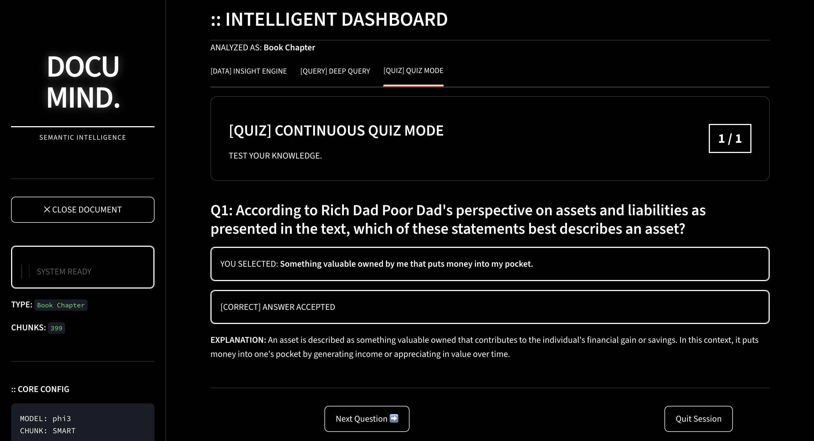

# 📄 DocuMind AI

> An AI-powered document intelligence platform that enables semantic document understanding, contextual question answering, structured summarization, and adaptive quiz generation using a fully local Retrieval-Augmented Generation (RAG) pipeline.


---

## 📖 Overview

DocuMind AI is a privacy-first document intelligence application that allows users to interact with PDF documents through natural language.

Instead of manually searching lengthy documents, users can upload a PDF and instantly generate structured summaries, ask contextual questions, and assess their understanding through AI-generated quizzes.

Unlike traditional document summarizers, DocuMind leverages **Retrieval-Augmented Generation (RAG)** to retrieve only the most relevant sections of a document before generating responses. The application runs entirely on a local machine using **Ollama**, ensuring that sensitive documents never leave the user's system.

---

## ✨ Features

- 📄 Upload and analyze PDF documents
- 📝 Generate structured executive summaries
- 💬 Context-aware semantic question answering
- 🧠 Retrieval-Augmented Generation (RAG)
- 🔍 Semantic similarity search using FAISS
- 📚 Source-aware response generation
- 🎯 AI-generated continuous quiz mode
- 📊 Confidence score for generated answers
- 🏷 Automatic document classification
- 🔒 Fully local inference using Ollama
- 🎨 Modern cyber-inspired Streamlit interface

---

## 🖥️ Application Preview

### Home Screen


---

### Semantic Question Answering


---

### Executive Summary


---

### Continuous Quiz Mode



---

## 🛠️ Technology Stack

| Category | Technology |
|----------|------------|
| Language | Python |
| Frontend | Streamlit |
| LLM | Ollama (Phi-3) |
| Embedding Model | Sentence Transformers |
| Vector Store | FAISS |
| PDF Processing | PyMuPDF |
| Numerical Computing | NumPy |

---

## ⚙️ How It Works

```
          PDF Upload
               │
               ▼
      Text Extraction
               │
               ▼
      Intelligent Chunking
               │
               ▼
 Sentence Transformer Embeddings
               │
               ▼
        FAISS Vector Index
               │
──────── User Question ────────
               │
               ▼
      Semantic Similarity Search
               │
               ▼
     Most Relevant Document Chunks
               │
               ▼
       Ollama (Phi-3)
               │
               ▼
 Answer • Summary • Quiz
```

---

## 📂 Project Structure

```
DocuMind/
│
├── data/
│   ├── sample.pdf
│
├── src/
│   ├── app.py
│   ├── chunking.py
│   ├── llm_logic.py
│   ├── main.py
│   ├── pdf_utils.py
│   ├── ui_components.py
│   └── vector_store.py
│
├── README.md
├── requirements.txt
└── .gitignore
```

---

## 🚀 Installation

Clone the repository

```bash
git clone https://github.com/YOUR_USERNAME/DocuMind.git

cd DocuMind
```

Create a virtual environment

### Windows

```bash
python -m venv venv

venv\Scripts\activate
```

### Linux / macOS

```bash
python3 -m venv venv

source venv/bin/activate
```

Install the dependencies

```bash
pip install -r requirements.txt
```

---

## ▶️ Running the Application

Ensure Ollama is installed and the Phi-3 model is available.

```bash
ollama pull phi3
```

Start the application

```bash
streamlit run src/app.py
```

Open the URL displayed by Streamlit in your browser.

---

## 💡 Usage

1. Launch the application.
2. Upload a PDF document.
3. Wait for the vector index to be generated.
4. Explore the document through:
   - Executive Summary
   - Semantic Question Answering
   - AI-generated Quiz Mode
5. Review confidence scores and contextual responses.

---

## 📌 Current Limitations

- Supports one PDF document at a time.
- OCR for scanned PDFs is not currently supported.
- Conversation history is not retained.
- Summary length cannot be customized.
- Requires a local Ollama installation.

---

## 🔮 Future Improvements

- Multiple document support
- OCR integration
- Persistent chat history
- Adjustable summary styles
- Multi-model selection
- Docker support
- Cloud deployment
- Citation highlighting within PDFs

---

## 🤝 Contributing

Contributions, issues, and feature requests are welcome.

Feel free to fork the repository and submit a pull request.

---

## 📄 License

This project is licensed under the MIT License.

---

## 👨‍💻 Author

**Anhar Eswaramangalam**

AI & Machine Learning Enthusiast

GitHub: https://github.com/AnharEM

LinkedIn: https://linkedin.com/in/anhareswaramangalam